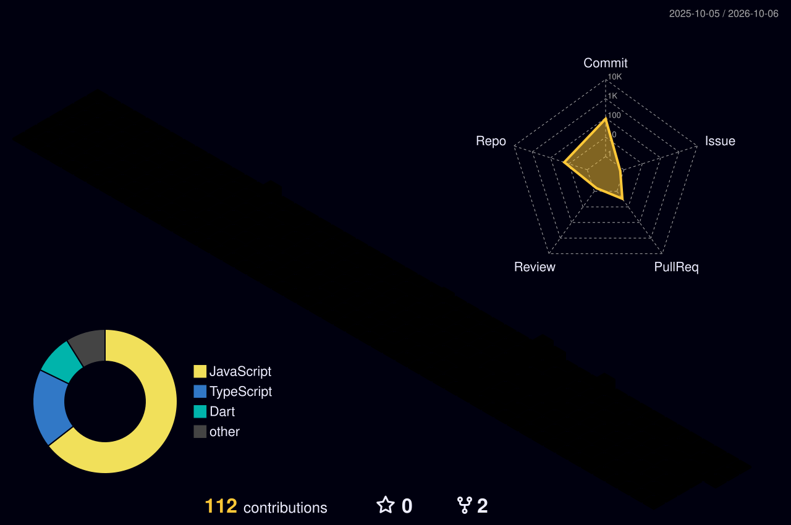

<!-- ============================ 3D HERO ============================ -->
<div align="center">




<p>
  <a href="https://github.com/dev-lover-codes"></a>
  <a href="https://github.com/dev-lover-codes?tab=followers"></a>
  <a href="https://medisync.is-a.dev"></a>
</p>

</div>


## 🧭 About Me

<table>
<tr>
<td width="58%" valign="top">

```yaml
student:    "3rd Year B.Tech, Computer Science & Technology"
institute:  "Maharaja Agrasen Institute of Technology (MAIT), Delhi"
background: "Lateral entry — Diploma in Electrical Engineering"
focus:      "Full Stack Product Development + AI Integration"
workflow:   "AI-assisted vibe coding via Antigravity & Gemini CLI"
currently:  "Building a 12-month placement-ready roadmap"
```

- 🎯 Targeting **Full Stack Product Developer** roles with strong **AI integration**
- 🏆 Competing in **Hack2skill PromptWars**, **SIH** and **Google Arcade**
- 🌱 Sharpening **C++ DSA** for placement prep
- ☁️ Deep into **Google Drive / Colab automation** & media pipelines
- 🎬 Hobby: converting **manhwa** into videos

</td>
<td width="42%" align="center" valign="middle">


</td>
</tr>
</table>


## ⚡ Tech Stack

<div align="center">

**💻 Languages**<br/><br/>


**🎨 Frontend, 3D & Mobile**<br/><br/>


**☁️ Backend, Data & Cloud**<br/><br/>


**🤖 AI & Dev Tooling**<br/><br/>


</div>


## 🚀 Featured Projects

<table>
<tr>
<td width="50%" valign="top">

### 🏥 [MediSync](https://github.com/dev-lover-codes/Medisync)
`Flutter` `Supabase` `Firebase`

A **51-screen clinical management system** spanning **6 role-based panels**, built on the custom **Velvet Clinical** design system.

🔗 **[medisync.is-a.dev](https://medisync.is-a.dev)**

</td>
<td width="50%" valign="top">

### 📒 [KhataMitra](https://github.com/dev-lover-codes/Khata-mitr)
`Supabase` `Vercel` `Gemini API`

**Bilingual (Hindi/English) AI-powered ledger** that makes bookkeeping accessible for local shopkeepers.

</td>
</tr>
<tr>
<td width="50%" valign="top">

### 🌱 [CarbonSync](https://github.com/dev-lover-codes/CarbonSync)
`React` `Three Fiber` `Firebase` `Gemini API`

A **3D carbon-tracking web app** built for **PromptWars Challenge 3**, with heavy iteration on test coverage and security hardening.

</td>
<td width="50%" valign="top">

### 🗳️ [VoteWise](https://github.com/dev-lover-codes/VoteWise)
`Stitch` `Spline` `Firebase Auth` `Supabase` `Claude API`

A **PromptWars** entry exploring **AI-assisted, secure digital voting** experiences.

</td>
</tr>
<tr>
<td width="50%" valign="top">

### 🎮 [ArenaIQ](https://github.com/dev-lover-codes/Arena_IQ)
`TypeScript` `Full Stack`

Built for a timed challenge, reaching **116/116 tests passing** — rapid, AI-assisted shipping under pressure.

</td>
<td width="50%" valign="top">

### 🤝 [Saathi-Vyapar](https://github.com/dev-lover-codes/Saathi-Vyapar)
`TypeScript`

My newest build — already **forked by other developers**. 🍴

</td>
</tr>
<tr>
<td width="50%" valign="top">

### 🛡️ [VoiceGuard](https://github.com/dev-lover-codes/voiceguard_sih)
`JavaScript` `Smart India Hackathon`

Built for **SIH** — a hackathon project under the VoiceGuard banner.

</td>
<td width="50%" valign="top">

### 📸 Insta_saver
`yt-dlp` `ffmpeg` `Meta Graph API` `Docker`

An **Instagram reel-saving DM bot**, containerized and deployed on **Render**.

</td>
</tr>
</table>

<details>
<summary><b>🧪 More experiments & automation work</b></summary>
<br/>

- ⚙️ **C++ Auto-Runner for Colab** — eliminates `%%cpp` magic tags with a safe leftover-magic stripper
- 🖼️ **Drive Photo Renamer** — parses Android/GCam filename patterns into clean, date-stamped names
- 📺 **Google Photos Streaming Site** — Picker API + Cloudflare Workers proxy for free public video streaming
- 🎞️ **Batch MKV Audio Pipeline** — parallel Colab sessions with heartbeat-based race protection for ffmpeg
- 📦 **Zero-Disk Zip Extractor** — chunked, threaded streaming directly between Drive paths
- 💪 **[Fitness Tracker App](https://github.com/dev-lover-codes/CodeAlpha_Fitness_Tracker)** — Flutter + Supabase + Riverpod via multi-phase agent prompting
- 🃏 **[3D Flip Cards](https://github.com/dev-lover-codes/CodeAlpha_3D_FlipCards)** — Flutter 3D card animations
- ♟️ **[Online Chess](https://github.com/dev-lover-codes/Online-chess-no-login-required)** — play instantly, no login required
- 🎨 **3D Engineering-Blueprint Portfolio** — Three.js-powered personal site

</details>


## 🧊 3D Contribution Skyline

<div align="center">



</div>

## 📊 GitHub Stats

<div align="center">


</div>

<div align="center">

</div>

<div align="center">
<picture>
  <source media="(prefers-color-scheme: dark)" srcset="https://raw.githubusercontent.com/dev-lover-codes/dev-lover-codes/output/github-snake-dark.svg"/>
  
</picture>
</div>


## 🤝 Connect with Me

<div align="center">

<a href="https://github.com/dev-lover-codes"></a>
<a href="https://medisync.is-a.dev"></a>
<!-- Add your real links, then uncomment:
<a href="https://linkedin.com/in/YOUR-USERNAME"></a>
<a href="https://x.com/YOUR-USERNAME"></a>
<a href="mailto:YOUR-EMAIL"></a>
-->

<br/><br/>


</div>
